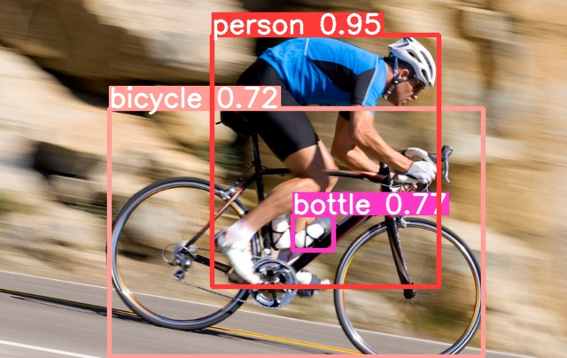
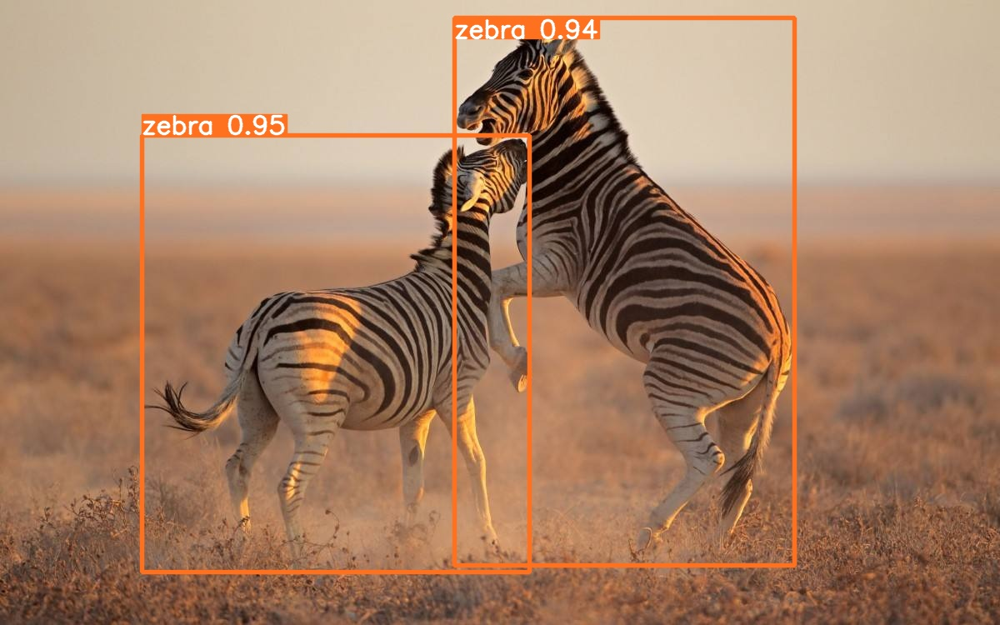

## YOLOAir :  Make the improvement of the YOLO model faster, more convenient

English | [简体中文](./README_CH.md)

The YOLOAir algorithm library is a combination toolbox of a series of YOLO detection algorithms based on PyTorch. Used to **combine different modules to build different networks**.  

<div align='center'>
    
</div>

✨Built-in model network structures such as YOLOv5, YOLOv7, YOLOX, YOLOR, Transformer, Scaled_YOLOv4, YOLOv3, YOLOv4, YOLO-Facev2, TPH-YOLOv5, YOLOv5Lite, PicoDet (continuously updated🚀)...

**✨Module componentization**: Help users customize and quickly combine Backbone, Neck, Head, diversify network models, help scientific research improve detection algorithms, model improvements, and network permutation and combination 🏆. Build powerful network models.

**✨Unified model code framework, unified application method, unified parameter adjustment, unified improvement, easy module combination, and more powerful network model building**.
  

```

██╗   ██╗ ██████╗ ██╗      ██████╗      █████╗     ██╗    ██████╗ 
╚██╗ ██╔╝██╔═══██╗██║     ██╔═══██╗    ██╔══██╗    ██║    ██╔══██╗
 ╚████╔╝ ██║   ██║██║     ██║   ██║    ███████║    ██║    ██████╔╝
  ╚██╔╝  ██║   ██║██║     ██║   ██║    ██╔══██║    ██║    ██╔══██╗
   ██║   ╚██████╔╝███████╗╚██████╔╝    ██║  ██║    ██║    ██║  ██║
   ╚═╝    ╚═════╝ ╚══════╝ ╚═════╝     ╚═╝  ╚═╝    ╚═╝    ╚═╝  ╚═╝
```


✨Based on the YOLOv5 code framework, and synchronously adapt to the **stable YOLOv5_v6.1 update**, synchronize the v6.1 deployment ecosystem. Before using this project, you can learn about the YOLOv5 library.

[Features🚀](#Mainfeatures) • [Usage🍉](#Usage) • [Documentation📒](https://github.com/iscyy/yoloair) • [issues🌟](https://github.com/iscyy/yoloair/issues/new)

     

#### support
    
   

Project address: https://github.com/iscyy/yoloair

Part of the improved tutorial: [CSDN芒果汁没有芒果](https://blog.csdn.net/qq_38668236?type=blog)

### Main features🚀

🚀 Support more YOLO series algorithm model improvements (continuous update...)

The YOLOAir algorithm library summarizes a variety of mainstream YOLO series detection models, and a set of codes integrates multiple models:
- Built-in integrated YOLOv5 model network structure, YOLOv7 model network structure, YOLOR model network structure, YOLOX model network structure, Scaled_YOLOv4 model network structure, YOLOv4 model network structure, YOLOv3 model network structure, YOLO-FaceV2 model network structure, TPH-YOLOv5 model network structure The structure, YOLOv5-Lite model network structure, PicoDet model network structure, etc. are continuously updated...

|||
:-------------------------:|:-------------------------:
  |  

The above multiple detection algorithms use a unified model code framework, which is integrated in the YOLOAir library, with a unified task form and a unified application method. 
🌟It is convenient for researchers to improve the algorithm model of the paper, compare models, and realize the diversification of network combinations. including lightweight models and models with higher accuracy, which can be reasonably selected according to the scene, and achieve a balance between accuracy and speed. 
🌟the library supports decoupling of different structures and module components to make modules componentized. By combining different module components, users can customize and build different detection models according to different data sets or different business scenarios.

🔥🔥🔥 Heavy! ! ! As a supplement to the open source project of the attention mechanism, a 6300+ 🌟Star attention mechanism algorithm code base is strongly recommended 👉[External-Attention-pytorch](https://github.com/xmu-xiaoma666/External-Attention-pytorch)，The summary is very comprehensive, including various Attention, Self-Attention and other codes. The code is concise and easy to read, and one line of code implements the Attention mechanism. Welcome everyone to play!

🚀Support loading the official pre-training weights of YOLOv3, YOLOv4, YOLOv5, YOLOv7, YOLOR and other networks for transfer learning

🚀 Support more Backbone

- `CSPDarkNet series`  
`ResNet series`  
`RepBlock series`  
`ShuffleNet series`  
`Ghost series`  
`MobileNet series`  
`ConvNext series`  
`RepLKNet series`  
`RegNet series`  
`EfficientNet series`  
`Transformer series`  
`CNN and Transformer, etc.`  
Continuously updated 🎈 

🚀 Support more Necks

- The neck includes mainstream structures such as FPN, PANet, and BiFPN.
 Continuously updated 🎈

🚀Support more detection heads
-  YOLOv4、YOLOv5 Head、
-  YOLOR Implicit Head、
-  YOLOX Decoupled Head、DetectX Head
-  Adaptively Spatial Feature Fusion Head(ASFF)、
-  YOLOv7 IAuxDetect Head, IDetect Head；

🚀Support for more plug-and-play attention mechanisms
- Plug-and-play use of attention mechanisms anywhere in the network  
Self Attention  
Contextual Transformer  
Bottleneck Transformer  
S2-MLP Attention  
SK Attention  
CBAM Attention  
SE Attention  
Coordinate attention  
NAM Attention  
GAM attention  
ECA Attention  
Shuffle Attention  
DANet Attention and other mainstream attention mechanisms  

🚀Support for more IoU loss functions
- Loss functions such as CIoU, DIoU, GIoU, EIoU, SIoU, alpha IOU, etc.  

🚀 More spatial pyramid pooling structures  
- SPP / SPPF / ASPP / RFB / SPPCSPC, etc.  

🚀Support more NMS
- NMS、Merge-NMS、DIoU-NMS、Soft-NMS、CIoU_NMS、DIoU_NMS、GIoU_NMS、EIoU_NMS、SIoU_NMS、Soft-SIoUNMS、Soft-CIoUNMS、Soft-DIoUNMS、Soft-EIoUNMS、Soft-GIoUNMS, etc.  

🚀Support for more data augmentation
- Mosaic、Copy paste、Random affine(Rotation, Scale, Translation and Shear)、MixUp、Augment HSV(Hue, Saturation, Value、Random horizontal flip

🚀Support more Loss
- ComputeLoss、ComputeNWDLoss、ComputeLoss(X)、ComputeLoss(v6)、ComputeLossAuxOTA(v7)、ComputeLossOTA(v7), etc.

🚀Supports Anchor-base and Anchor-Free

🚀Supports Weighted Box Fusion (WBF)

🚀 Built-in multiple network model modular components
- Conv, GhostConv, Bottleneck, GhostBottleneck, SPP, SPPF, DWConv, MixConv2d, Focus, CrossConv, BottleneckCSP, C3, C3TR, C3SPP, C3Ghost etc.
Detailed code search in **./models/common.py file**🔍👉[Corresponding module link](https://github.com/iscyy/yoloair/blob/main/models/common.py)

- 👉[Network Model Structure Diagram](https://github.com/iscyy/yoloair/blob/main/docs/document/model_.md) 

The above component modules use a unified model code framework, unified task form, and unified application method. **Module componentization**🚀 can help users customize and quickly combine Backbone, Neck, and Head, diversify network models, and help scientific research improve detection algorithms. Build stronger network models.

### Built-in network model configuration support ✨

🚀Including yaml configuration of YOLOv3, YOLOv4, Scaled_YOLOv4, YOLOv5, YOLOv7, YOLOX, YOLOR, Transformer, YOLO-FaceV2, PicoDet, YOLOv5-Lite, TPH-YOLOv5 ** other algorithm models such as improved network structure** File Summary (Recommended 🌟🌟🌟🌟🌟)

The YOLOv7 official repository is currently being updated

## Usage🍉

**About the code.** Follow the design principle of [YOLOv5](https://github.com/ultralytics/yolov5).  
The original version was created based on YOLOv5(v6.1)

### Install

Clone repo and install requirements.txt in a **Python>=3.7.0** environment, including **PyTorch>=1.7**. 
```bash
$ git clone https://github.com/iscyy/yoloair.git
$ cd yoloair
$ pip install -r requirements.txt
```

### Training

```bash
$ python train.py --data coco128.yaml --cfg configs/yolov5/yolov5s.yaml
```

### Inference

`detect.py` runs inference on a variety of sources,  saving results to `runs/detect`.

```bash
$ python detect.py --source 0  # webcam
                          img.jpg  # image
                          vid.mp4  # video
                          path/  # directory
                          path/*.jpg  # glob
```

### fusion
If you use different models to infer on the dataset, you can use the wbf.py file to integrate the results via weighted box fusion.
You just need to set img path and txt path in wbf.py file.
```bash
$ python wbf.py
```

### Benchmark
Updating...

### YOLO network model specific improvement method tutorial and principle reference

More module improvement explanation tutorials are continuously updated...

### YOLOv5 official tutorial ✨
Sync with YOLOv5 framework

- [Train Custom Data](https://github.com/ultralytics/yolov5/wiki/Train-Custom-Data)  🚀 RECOMMENDED
- [Tips for Best Training Results](https://github.com/ultralytics/yolov5/wiki/Tips-for-Best-Training-Results)  ☘️ RECOMMENDED
- [Multi-GPU Training](https://github.com/ultralytics/yolov5/issues/475)
- [PyTorch Hub](https://github.com/ultralytics/yolov5/issues/36) 🌟 NEW
- [TFLite, ONNX, CoreML, TensorRT Export](https://github.com/ultralytics/yolov5/issues/251) 🚀
- [Test-Time Augmentation (TTA)](https://github.com/ultralytics/yolov5/issues/303)
- [Model Ensembling](https://github.com/ultralytics/yolov5/issues/318)
- [Model Pruning/Sparsity](https://github.com/ultralytics/yolov5/issues/304)
- [Hyperparameter Evolution](https://github.com/ultralytics/yolov5/issues/607)
- [Transfer Learning with Frozen Layers](https://github.com/ultralytics/yolov5/issues/1314)
- [Architecture Summary](https://github.com/ultralytics/yolov5/issues/6998) 🌟 NEW
- [Weights & Biases Logging](https://github.com/ultralytics/yolov5/issues/1289)
- [Roboflow for Datasets, Labeling, and Active Learning](https://github.com/ultralytics/yolov5/issues/4975)  🌟 NEW
- [ClearML Logging](https://github.com/ultralytics/yolov5/tree/master/utils/loggers/clearml) 🌟 NEW
- [Deci Platform](https://github.com/ultralytics/yolov5/wiki/Deci-Platform) 🌟 NEW

</details>

### Future enhancement ✨
In the future, we will continue to build and improve the YOLOAir ecosystem
Improve and integrate more YOLO series models, continue to combine different modules to build more different network models
Horizontal expansion and introduction of associative techniques, such as semi-supervised learning, etc.
Follow up: YOLO-mask & YOLO-pose

______________________________________________________________________

## Statement
<details><summary> <b>Expand</b> </summary>

* The content of this site is only for sharing notes. If some content is infringing, please sending email.

* If you have any question, please discuss with me by sending email.
</details>

## Acknowledgements

<details><summary> <b>Expand</b> </summary>

[https://github.com/ultralytics/yolov5](https://github.com/ultralytics/yolov5)  
[https://github.com/AlexeyAB/darknet](https://github.com/AlexeyAB/darknet)  
[https://github.com/ultralytics/yolov3](https://github.com/ultralytics/yolov3)  
[https://github.com/WongKinYiu/PyTorch_YOLOv4](https://github.com/WongKinYiu/PyTorch_YOLOv4)  
[https://github.com/WongKinYiu/ScaledYOLOv4](https://github.com/WongKinYiu/ScaledYOLOv4)   
[https://github.com/meituan/YOLOv6](https://github.com/meituan/YOLOv6)  
[https://github.com/WongKinYiu/yolov7](https://github.com/WongKinYiu/yolov7)  
[https://github.com/WongKinYiu/yolor](https://github.com/WongKinYiu/yolor)   
[https://github.com/xmu-xiaoma666/External-Attention-pytorch](https://github.com/xmu-xiaoma666/External-Attention-pytorch)  
[https://gitee.com/SearchSource/yolov5_yolox](https://gitee.com/SearchSource/yolov5_yolox)  
[https://github.com/Krasjet-Yu/YOLO-FaceV2](https://github.com/Krasjet-Yu/YOLO-FaceV2)  
[https://github.com/positive666/yolov5_research/](https://github.com/positive666/yolov5_research)  
[https://github.com/ppogg/YOLOv5-Lite](https://github.com/ppogg/YOLOv5-Lite)  
[https://github.com/Gumpest/YOLOv5-Multibackbone-Compression](https://github.com/Gumpest/YOLOv5-Multibackbone-Compression)  
[https://github.com/cv516Buaa/tph-yolov5](https://github.com/cv516Buaa/tph-yolov5)
Paper:[https://arxiv.org/abs/2208.02019](https://arxiv.org/abs/2208.02019)  

</details>
